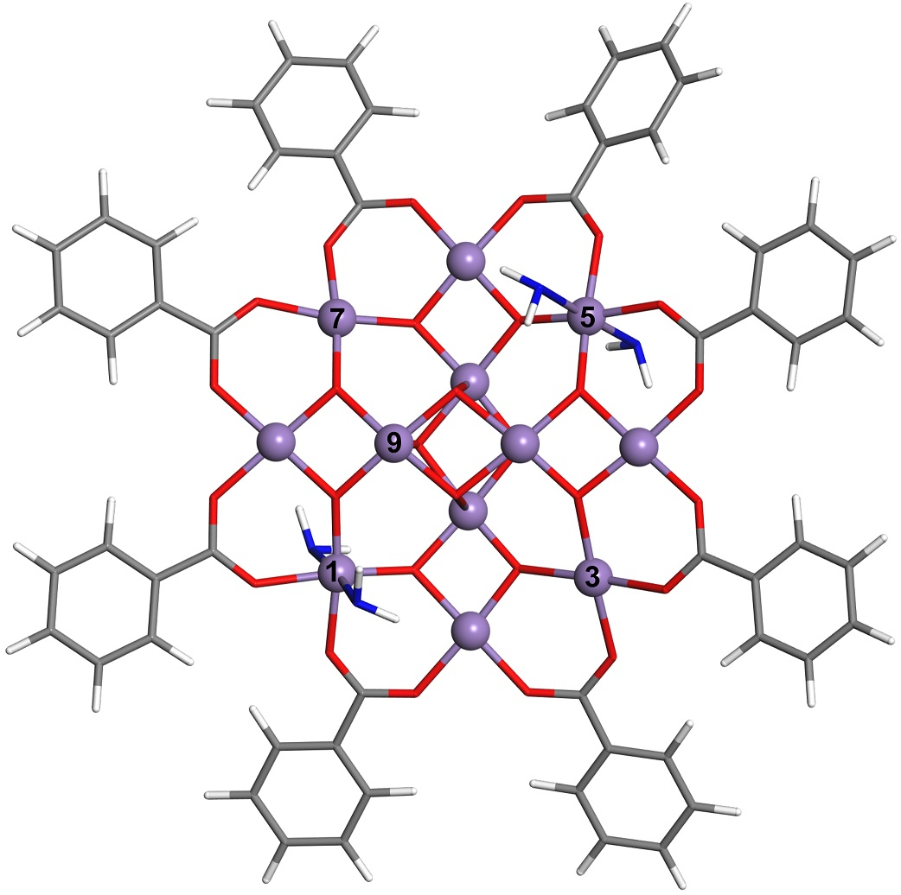

# SMM [Mn12-C6H5]-

Single-molecule magnetic complex [Mn12-C6H5]- in 2:2 isomeric form and in -1 charge state with an extra electron located at:

   [atom Mn12](Mn12-C6H5_22_atom12.xsf)  (#1 in paper notation) (0.0 meV)     
   [atom Mn10](Mn12-C6H5_22_atom10.xsf) (#3 in paper notation) (+157.0 meV)   
   [atom Mn4](Mn12-C6H5_22_atom4.xsf)   (#9 in paper notation) (+13.0 meV)

   

**Figure**. SMM [Mn12-C6H5]. Mn atoms are purple balls. Oxygen and carbon atoms are at vertices of red and grey bars, hydrogen atoms are at the open ends of white bars. Four water molecules are shown as blue-white sticks forming 2:2 isomeric configuration. Four carboxylate groups O2C-C6H5 in front and four at the rear of the molecule are removed for clarity.
