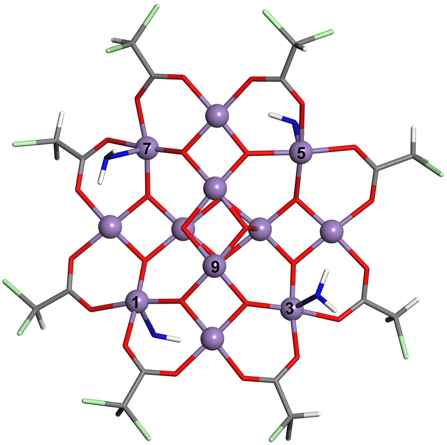

# SMM [Mn12-CHCl2]-

Single-molecule magnetic complex [Mn12-CHCl2]- in 1:1:1:1 isomeric form and in -1 charge state with an extra electron located at:

   [atom Mn8](Mn12-CHCl2_atom8.xsf)  (#1 in paper notation) (0.0 meV)     
   [atom Mn2](Mn12-CHCl2_atom2.xsf)  (#9 in paper notation) (+28.0 meV)

   

**Figure**. SMM [Mn12-CHCl2]. Mn atoms are purple balls. Oxygen and carbon atoms are at vertices of red and grey bars, hydrogen and chlorine atoms are at the open ends of white and green bars. Four water molecules are shown as blue-white sticks forming 1:1:1:1 isomeric configuration. Four carboxylate groups O2C-CHCl2 in front and four at the rear of the molecule are removed for clarity.
