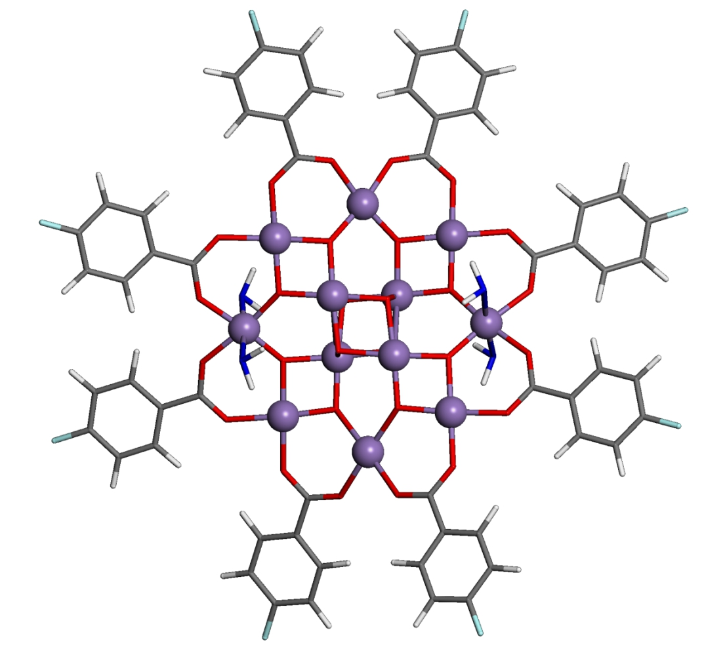

# Single-molecule magnetic complexes [Mn12O12(O2CR)16(H2O)4]-   

Single-molecule magnetic complexes [Mn12O12(O2C-R)16(H2O)4]- with R=   

   * [-H (1:1:1:1)](Mn12-H_1_1_1_1)
   * [-H (2:2)](Mn12-H_2_2)
   * [-CH3 (1:1:1:1)](Mn12-CH3)
   * [-CHCl2 (1:1:1:1)](Mn12-CHCl2)
   * [-C6H5 (2:2)](Mn12-C6H5)
   * [-C6H4F (2:2)](Mn12-C6H4F)

If you use these structures in your research, please cite the following paper:

Dmitry Skachkov, Shuang-Long Liu, Jia Chen, George Christou, Arthur F. Hebard, Xiao-Guang Zhang, Samuel B. Trickey, and Hai-Ping Cheng   
Dipole Switching by Intramolecular Electron Transfer in Single-Molecule Magnetic Complex [Mn12O12(O2CR)16(H2O)4]   
https://doi.org/10.26434/chemrxiv-2022-m5fgw     

   

**Figure**. SMM [Mn12-C6H4F]. Mn atoms are purple balls. Oxygen and carbon atoms are at vertices of red and grey bars, correspondingly. Hydrogen and fluorine atoms are at the open ends of white and green bars, correspondingly. Four water molecules are shown as blue-white sticks. Four carboxylate groups O2C-C6H4F in front and four at back of the molecule are removed for clarity.
